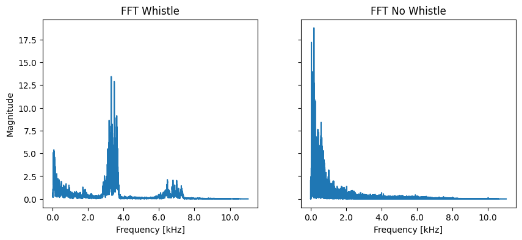
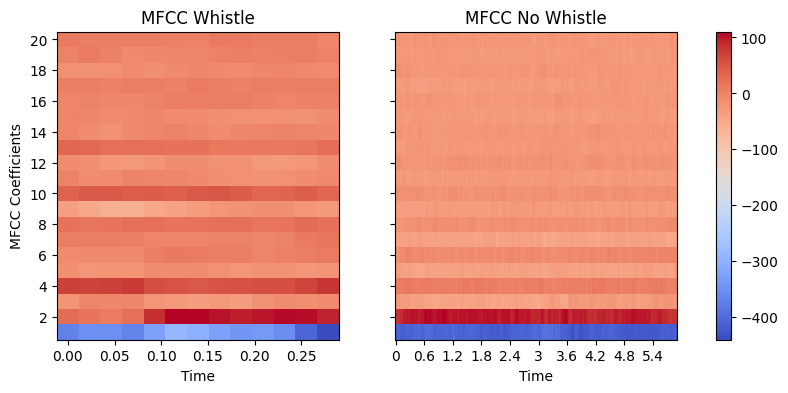
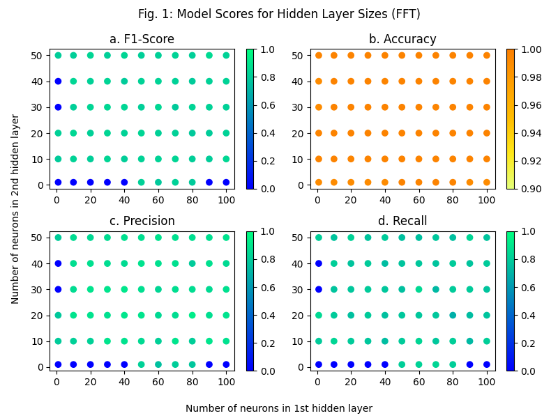
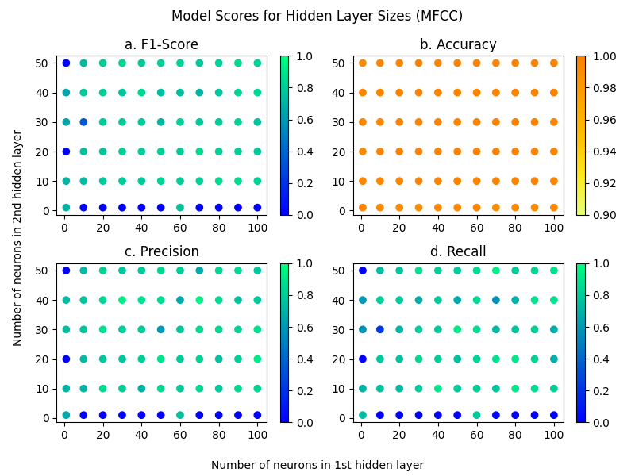

# Erkennung von Pfiffen für NAO Robots

## Einleitung

Die Robocup [Standard Platform League (SPL)](https://spl.robocup.org/) ist eine internationale Liga
im Roboterfußball. In dieser Liga treten Teams von verschiedenen Hochschulen und Universitäten
weltweit gegeneinader an. Verwendet wird dabei ein für alle Teams baugleicher Roboter vom Typ
[NAO](https://www.aldebaran.com/en/nao) der Firma [Aldebaran](https://www.aldebaran.com/en).

Die Spielregeln werden dabei kontinuierlich erweitert, um sich Stück für Stück den Regeln des
menschlichen Fußballs anzunähern. In diesem Zuge wurde eine neue Regeln eingeführt, die fordert,
dass die Roboter Pfiffe der Schiedsrichter:innen erkennen und darauf reagieren können sollen.

Das Team der [HTWK Robots](https://robots.htwk-leipzig.de/startseite) hat daher bereits Audiodaten
von vergangenen Spielen gesammelt und Labels dazu erstellt. Durch dieses Projekt, im Rahmen des
Moduls [Mustererkennung](https://modulux.htwk-leipzig.de/modulux/modul/6325), wird untersucht, wie
die Erkennung der Pfiffen mit Hilfe von Methoden der Mustererkennung durchgeführt werden können.


## Datenbasis

### Initiale Daten

Initial haben wir die Daten vom *HTWK Robots*-Team erhalten. Das Paket beinhaltete verschiedene
Audio-Aufnahmen der Roboter, welche während diversen Spielen aufgenommen wurden. Diese lagen im
*Free Lossless Audio Codec* (`flac`) vor. Zu den meisten Audio-Dateien gab es eine entsprechende
CSV-Datei, welche die Label beinhaltet. Zugehörige Dateien sind (bis auf ihre Dateiendung) identisch
benannt. In diesem Projekt sind die Dateien unter `src/data` abgelegt. Die Dateistruktur sieht wie
folgt aus:

```
src
├── data
│   ├── 01.csv
│   ├── 01.flac
│   ├── 02.csv
│   ├── 02.flac
...
```

Die Label-Dateien beinhalten die folgenden Spalten: `start`, `end` und das entsprechende `label`
für den spezifizierten Zeitraum. Die Label unterscheiden sich dabei in drei Arten:

- `No_Whistle`: In dem Zeitraum war kein Pfiff zu hören
- `Whistle`: In dem Zeitraum war ein Pfiff zu hören
- `False_Whistle`: In dem Zeitraum war ein Pfiff zu hören, der allerdings zu einem anderen Feld
  gehört und daher nicht als Pfiff für den Roboter gilt.

Im Folgenden ist ein Beispiel für eine Label-Datei dargestellt.

```csv
start,end,label
62.35092589842589,68.25101351351351,No_Whistle
68.97197278911564,69.7730612244898,Whistle
70.05104024354024,91.55135951885953,No_Whistle
93.70139144639144,96.25142931392931,False_Whistle
```

Weiterhin haben wir uns dazu entschieden, zunächst `False_Whistle` nicht anders als `Whistle` zu
klassifizieren, um ein Grundverständnis für das Problem zu erhalten. Im Verlauf des Projekts hat
sich herausgestellt, dass wir die keine Zeit mehr für die Differenzierung zwischen diesen beiden
Labeln hatten.

Die Datenbasis können wir aus Lizenz- und Speichergründen nicht mit im Repository veröffentlichen.
Eine Anleitung, wie eigene Daten hinzugefügt werden können, ist in der 
[`src/data/README.md`](../src/data/README.md#adding-your-data) zu finden. Dabei ist ein Skript
zur Datenvorverarbeitung enthalten, welche im folgenden Abschnitt genauer erläutert wird.


### Vorverarbeitung der Rohdaten

Die Rohdaten enthielten teilweise Audio-Dateien ohne zugehörige Label-Datei oder vice versa.
Außerdem ist es im weiteren Verlauf wichtig gewesen, dass die Audio-Dateien exakt so wie die
Label- Dateien benannt sind. Teilweise existierten auch mehrere CSV-Dateien, welche sich auf
dieselbe Audio-Datei bezogen. Dabei sollen stets jene verwendet werden, die den `csv_new.csv`-Suffix
verwenden. Das Skript [`src/data/add_data.sh`](../src/data/add_data.sh) stellt diese
Anforderungen sicher.

Zunächst werden alle Daten, die ggf. in Unterverzeichnissen im spezifizierten *Source-Directory*
enthalten sind, in das Source-Directory verschoben. Falls es mehrere CSV-Dateien gibt, wird der
o.g. Anforderung entsprechend die neuere verwendet. Dafür wird die alte gelöscht und die neue
zur Datenstruktur passend umbenannt. Weiterhin werden alle Dateien gelöscht, die nicht sowohl eine
Audio-Datei als auch eine Label-Datei haben. Alle Dateien aus dem übergebenen Verzeichnis, welche
nicht auf `.flac` oder `.csv` enden, werden anschließend gelöscht. Schlussendlich werden die 
verbleibenden Dateien in das `src/data`-Verzeichnis verschoben und das Source-Directory gelöscht.
Somit sind die erforderlichen Daten im notwendigen Verzeichnis enthalten.

### Generierung der Grundmerkmale

Die Audio-Dateien wurden im Folgenden mittels der [`librosa`](https://librosa.org/)-Bibliothek
eingelesen. Die `librosa.load`-Funktion generiert eine Waveform, welche sie als `numpy`-Array
zurückgibt.

Das Einlesen der Label-Dateien haben wir mit der [`pandas`](https://pandas.pydata.org/)-Bibliothek
umgesetzt. Die Label wurden dann wie folgt auf die folgenden zwei Klassen abgebildet:

| Label           | Klasse |
|-----------------|--------|
| `No_Whistle`    | `-1`   |
| `Whistle`       | `+1`   |
| `False_Whistle` | `+1`   |

Zu Beginn des Projektes haben wir die Audio-Dateien nur anhand der Label-Datei geschnitten, d.h.
vom spezifizierten `start`-Wert bis zum `end`-Wert. Dieser Ansatz wird im Repository meist unter der
Bezeichnung `uncut` geführt.

Bei dem `uncut`-Ansatz war problematisch, dass die Waveform-Daten unterschiedlich lang sind. Ein
`numpy`-Array erwartet aber homogene Dimensionen. Daher haben wir den Ansatz des
[*Padding*](https://www.baeldung.com/cs/deep-neural-networks-padding) verwendet. Dies garantiert,
dass alle Daten die gleiche Dimension haben, in dem diese durch `0`-Werte ergänzt werden. Die
resultierenden Daten wurden als Basis verwendet, um verschiedene Features zu generieren (siehe
Abschnitt [Features](#features)).

Der Padding-Ansatz lieferte zwar gute Ergebnisse. Allerdings hatten wir die Vermutung, dass diese
durch den starken Unterschied von Pfiffen, die in der Regel sehr kurz (unter einer Sekunde) sind, im
Vergleich zu den `No_Whistle`-Abschnitten, welche in der Regeln eher lang sind. Aufgrund der
Null-Werte ist schnell und relativ zuverlässig erkennbar, ob es sich um eine Datei mit oder ohne
Pfiff handelt. Daher haben wir uns entschieden, weitere Ansätze zum Schneiden der Audio-Dateien
zu untersuchen. Diese werden im folgenden Abschnitt erläutert.


### Schnipsel-Ansätze

#### Erster Ansatz: `cut`

Der erste neue Ansatz zum Schneiden der Dateien sieht wie folgt aus. Jede Audio-Datei wird in
ein-sekündige Schnipsel geschnitten und entsprechend klassifiziert. Aus Beobachtungen der Rohdaten
wurde erkenntlich, dass die Pfiffe meistens kürzer als 0,4 Sekunden waren. Daraus folgerten wir,
dass wir die Start- und End-Zeiten nicht einfach runden können, da wir den Pfiff sonst verlieren
könnten und den Schnipsel falsch klassifizieren. Dies lässt sich am folgenden Beispiel darstellen:

$$
\begin{aligned}
  (\text{start},~\text{end}) &= (5.1,~5.4) \approx (5,~5) \\
  (\text{start},~\text{end}) &= (5.5,~5.9) \approx (6,~6)
\end{aligned}
$$

Hier ist zu erkennen, dass die beiden Zeiträume so gerundet wird, dass die Pfiffe in Sekunde 5
nicht als solche verarbeitet werden. Daher war unser erster Ansatz, einen Threshold $\theta = 0.1$
als Konstante einzuführen. Die Start- und Endwerte sollten dabei wie folgt gerundet werden.

$$
\begin{aligned}
  \texttt{start}(t) &= \begin{cases}
    \lceil t \rceil, &\left(t \bmod 1 \right) > 1 - \theta \\
    \max\left( 0, \lfloor t \rfloor\right), &\text{sonst}
  \end{cases}
  \\
  \texttt{end}(t) &= \begin{cases}
    \max\left( 0, \lfloor t \rfloor \right), &\left(t \bmod 1 \right) < \theta \\
    \lceil t \rceil, &\text{sonst}
  \end{cases}
\end{aligned}
$$

Die Implementierung kann unter
[`src/research/cut/cut.ipynb`](../src/research/cut/cut.ipynb) nachvollzogen werden. Dort ist in der
letzten Zelle erkennbar, dass insgesamt mehr Schnipsel als `whistle` markiert wurden, als
tatsächlich aus den originalen Daten hervorgegangen ist. Wir haben zunächst unsere Modell auf dieser
Basis trainiert. Da wir mit diesem Ansatz allerdings nicht gänzlich zufrieden waren, haben wir
später einen weiteren Ansatz konzipiert. Dieser wird im folgenden Abschnitt erläutert.


#### Zweiter Ansatz: `new_cut`

Das Ziel des zweiten Ansatzes war es, keine Daten in der Vorverarbeitung zu verfälschen. Ein
Mechanismus dafür war es, Pfiffe, die ungünstig zwischen zwei Sekunden liegen, zu löschen. Das
ursprüngliche Konzept ist in
[`src/research/new_cut/new_cut_approach.pdf`](../src/research/new_cut/new_cut_approach.pdf)
veranschaulicht und wird im Folgenden erklärt.

Zunächst haben wir erneut einen Threshold $\theta = 0.1$ festgelegt. Anschließend geht die Funktion
`cut_labels` (siehe [`src/research/new_cut/new_cut.ipynb`](../src/research/new_cut/new_cut.ipynb))
eine Label-Datei zeilenweise (d.h. entsprechend der definierten Intervalle) durch.

Zunächst legen wir ein Array an, welches exakt so lang ist, wie die Länge der Audio-Schnipsel für
diese Datei. Dieses wird mit dem Label für kein Pfiff initialisiert. Wenn das aktuell betrachtete
Intervall keinen Pfiff enthält, belassen wir das Label-Array an dem zugehörigen Index so. Falls
allerdings ein Pfiff enthalten ist, muss die Start- und Endzeit genauer betrachtet werden.

Zunächst bestimmen wir den Abstand des Startwertes von der (ganzen) Startsekunde
(`duration_end_sec`) und den Abstand des Endwertes zur Endsekunde (`duration_end_sec`). Wenn der
Abstand zur Startsekunde über dem Threshold $\theta = 0.1$ liegt, wird die ganze Startsekunde als
Pfiff gewertet, da hier ein hinreichender Pfiff zu hören ist. Falls dem nicht so ist, wird die
Startsekunde zu einem extra Array `to_remove` hinzugefügt. Alle Sekunden, die am Ende der Funktion
dort enthalten sind, werden im folgenden aus den Daten gelöscht.

Dies begründet sich darin, dass in der Sekunde ein Pfiff nur kürzer als der Threshold $\theta$ zu
hören ist. Da wir die markierten Daten nicht verfälschen wollten, haben wir diese entsprechend
entfernt. In der Praxis wäre es hier egal, wie das entsprechende Modell klassifiziert, sodass hier
kein Nachteil entstanden ist.

Selbiges wird mit dem Abstand zur Endsekunde durchgeführt. Ist dieser größer oder gleich dem
Threshold $\theta$, wird die Endsekunde als Pfiff markiert. Ansonsten wird diese als zu entfernen
markiert und im Folgenden aus dem Datensatz gelöscht.

Im zugehörigen [Notebook](../src/research/new_cut/new_cut.ipynb) ist ein Beispiel dafür aufgezeigt
– siehe Abschnitt *Debug print from `cut_labels`*. Dort ist zu sehen, dass die Daten wie von uns
erwartet und konzipiert markiert bzw. entfernt werden.


#### Dritter Ansatz: `new_cut_ratio`

Nach den Experimenten mit dem vorhergehenden Ansatz war zwar eine Verbesserung erkennbar. Allerdings
wurden dennoch viele Pfiffe als kein Pfiff klassifiziert. Nach einigen Überlegungen stellen wir die
These auf, dass das Verhältnis der Schnipsel ohne Pfiff im Vergleich zu den Ausschnitten mit Pfiff
ggf. einen Einfluss haben könnte. Wir haben insgesamt 120-Mal mehr Sekunden ohne Pfiff als mit,
siehe u.a. in diesem [Notebook](../src/research/mfcc/new_cut_ratio/perceptron.ipynb). Daher wollten
wir die Leistung der verschiedenen Modelle (siehe Abschnitt [Modelle](#modelle)) in Abhängigkeit von
verschiedenen Verhältnissen der Label untersuchen.

Da das MFCC-Feature wesentlich schneller zu generieren war als die FFTs – mehr dazu im folgenden
– [Abschnitt](#features) – entschieden wir uns, diesen Ansatz ausschließlich für erste zu
untersuchen. Den Ansatz zur Ermittlung des Bias kann in der
[`README`](../src/research/mfcc/new_cut_ratio/README.md#ansatz-für-ermittlung-des-bias) unter
`src/research/mfcc/new_cut_ratio` genauer nachgelesen werden. Die Ergebnisse werden im Abschnitt
[Ergebnisse](#ergebnisse) dargestellt.


## Features

Für das Projekt haben wir uns zwei verschiedene Feature überlegt: die *Fast Fourier-Transformation*
(FFT) und *Mel Frequency Cepstral Coefficients* (MFCC). Diese werden in den folgenden Abschnitten
kurz erläutert.


### Fast Fourier-Transformation

Die Fourier-Transformation macht sich den Fakt zunutze, dass jedes beliebige periodische Signal
durch eine Überlagerung von unendlich vielen Sinus- und Cosinus-Schwingungen durch unterschiedliche 
Frequenzen und Amplituden erzeugt werden kann. Denn dies bedeutet um Umkehrschluss, das jedes
periodische Signal auch wieder in eine Reihe aus unendlich vielen Sinus- und Cosinus-Schwingungen
zerlegt werden kann. Die Fourier-Transformation zerlegt somit ein periodisches Signal in seine
Grundfrequenzen.

Nicht-periodische Signale können zerlegt werden in dem ein Abschnitt des Signales gewählt wird und
als eine einzelne Periode angesehen wird. Somit entsteht für diesen Abschnitt ein kontinuierliches
Frequenzspektrum.

Die Fast Fourier-Transformation (FFT) ist ein Algorithmus, der sehr schnell eine abgetastete Version
des kontinuierlichen Spektrums für diesen Abschnitt erstellen kann. Das Audiosignal kann damit in
die einzelnen Frequenzanteile zerlegt werden und gibt zu jeder Frequenz an, wie stark sie im
jeweiligen Abschnitt enthalten ist[^3]. Somit sollen durch die FFT diejenigen Frequenzen
herausgefiltert werden, welche für einen Pfiff typisch sind.

In der folgenden Abbildung sind zwei Plots des FFT-Features zu sehen. Auf der linken Seite ist ein
Ausschnitt mit Pfiff zu sehen, auf der rechten einer ohne. Dabei ist zu erkennen, dass sich die
Frequenzen deutlich unterscheiden. Links ist eine deutliche Spitze zwischen 2 und 4 kHz zu sehen,
welche im rechten Diagramm nicht erkennbar ist. Dort liegt die Spitze im niedrigen Frequenzbereich.
Daher ist unsere Vermutung, dass die Modelle die beiden Klassen gut trennen können sollten.




### Mel Frequency Cepstral Coefficients

Die Mel Frequency Cepstral Coefficients (MFCC) wurden zur Modellierung von Audio-Eigenschaften
entwickelt. Dabei werden die Dimensionen der Audio-Daten start reduziert ohne dabei wichtige
Eigenschaften zu verlieren. Dies wird erreicht indem die Oberschwingungen (*Harmonics*) und die
Seitenbänder (*Sidebands*) des Signalspektrums extrahiert werden . Dabei soll das menschliche Gehör
nachempfunden werden. Dieses Feature ist in der Mustererkennung, v.a. bei der Stimmen- und
Spracherkennung besonders beliebt. Allerdings werden bei der Verkleinerung Informationen über die
Tonlage (*Pitch*) verloren[^1][^2].

In der folgenden Abbildung sind ebenfalls zwei Plots des MFCC-Features zu erkennen. Auf der linken
Seite ist ein Ausschnitt mit Pfiff, auf der rechten einer mit abgebildet. Dabei ist zu erkennen,
dass es eine kurze Pause im roten 2-MFCC-Koeffizienten gibt. Außerdem sind leichtere Unterschiede in
den höheren Koeffizienten zu sehen.



Der Unterschied ist zwar vorhanden, aber nicht so groß wie beim FFT-Feature. Unsere Vermutung ist
daher, dass die Modelle mit diesem Feature nicht so gut abschneiden wie jene, die auf dem
FFT-Feature trainiert werden.

Im Verlauf des Projektes hat sich herausgestellt, dass sowohl die  MFCC-Generierung als auch das
Trainieren der verschiedenen Modelle zwar im Vergleich zur FFT sehr viel schneller funktioniert.
Allerdings waren die Ergebnisse wesentlich schlechter und meist für die Praxis unbrauchbar. Darauf
wird genauer im Abschnitt [Ergebnisse](#ergebnisse) eingegangen. Zunächst werden allerdings die
verschiedenen betrachteten Modelle erläutert.


## Modelle

Im Verlauf des Projektes haben wir unterschiedliche Modelle und Verfahren zur Klassifikation
trainiert. Diese stammten meist aus der Python-Bibliothek
[`scikit-learn`](https://scikit-learn.org/stable/index.html). Dabei haben wir uns vorrangig auf die
Modelle fokussiert, welche in dieser Lehrveranstaltung (Mustererkennung) sowie in der
Lehrveranstaltung *Numerische Methoden im Data Science und Machine Learning* von
[Prof. Patrick Kürschner](https://sites.google.com/view/patrickkuerschner/) vorgestellt wurden.

Insgesamt haben wir die folgenden Modelle untersucht:

- Perzeptron
- Multi-layered Perzeptron
- Gradientenverfahren (*Gradient Descent*, GD) (eigene Implementierung)
- Stochastisches Gradientenverfahren (*Stochastic Gradient Descent*, SGD)
- Support Vektor Maschine (SVM, *Support Vector Classifier*)

Die Modelle werden im folgenden Abschnitt ausgewertet.


### Experimente mit MLP Hidden-Layer-Size

Bei den Multi-layered Perzeptronen ist die Größe der Hidden Layers entscheidend. Daher haben wir uns
dafür entschieden, diesen Parameter genauer zu untersuchen. Als Basis trainieren wir jeweils ein MLP
mit den folgenden Größen:

$$\{ (1,1),~(1,10),~(1,20),~\ldots,~(1,50),~(10,1),~(10,10),~\ldots,~(10,50),~\ldots,~(100,50)\}$$

Die erste Zahl des Tupels beschreibt dabei die Anzahl der Neuronen in der ersten Hidden Layer, die
zweite die Zahl in der zweiten. Wir erwarten, dass dieser Parameter einen großen Einfluss auf die
Leistung des Modells hat. Die Ergebnisse werden im folgenden Kapitel ausgewertet.


## Ergebnisse

In diesem Abschnitt werden die Resultate aus den verschiedenen Modellen und Schnitt-Ansätzen
dargelegt. Die Bewertung findet aufgrund des realen Szenarios wie folgt ab. Es ist für die Roboter
besser, einen tatsächlich aufgetretenen Pfiff *nicht* zu erkennen, als eine Sekunde, in der kein
Pfiff war, als Pfiff zu klassifizieren. Dementsprechend wollen wir die False-Positives minimieren.
Somit bewerten wir im folgenden anhand der Präzision anstelle des Recalls.


### Ungeschnittene Daten

Zu erst haben wir die ungeschnittenen Daten untersucht. Dabei haben wir festgestellt, dass die
Generierung der FFT-Feature-Matrix sowie das Training der Modelle erheblich länger dauerten und
ressourcen-intensiv waren als für MFCC. Im späteren Verlauf stellten wir die These auf, dass dies
an der Länge der Dateien liegt. Es liegt nahe, dass die Generierung der FFT für kurze Dateien
wesentlich schneller geht als für große. Diese Annahme bestätigte sich bei der Betrachtung der
verschiedenen Schnipsel-Ansätze.

Aus diesem Grund konnten für FFT nur ein Bruchstück der Dateien untersuchen. Aus selbigem Grund
haben wir für die FFT nur die Support Vektor Maschine trainiert. Die Ergebnisse sehen wie folgt aus.

| Modell (Feature: MFCC)                                                  | Präzision | Recall | F1-Score |
|-------------------------------------------------------------------------|-----------|--------|----------|
| [Gradientenabstieg 2D](../src/research/gradient_descent/split_gd.ipynb) | 77.14%    | 87,10% | 0,81     |
| [Gradientenabstieg 10D](../src/research/gradient_descent/split_gd.ipynb)| 69,57%    | 84,21% | 0,76     |
| [Perzeptron](../src/research/mfcc/uncut/perceptron_mfcc.ipynb) | 93,26%    | 100%   | 0,97     |
| [SGD](../src/research/mfcc/uncut/sgd_mfcc.ipynb)               | 93,26%    | 100%   | 0,97     |
| [SVM](../src/research/mfcc/uncut/svc_mfcc.ipynb)               | 95,40%    | 100%   | 0,98     |


In der vorangestellten Tabelle ist zu erkennen, dass das Gradientenabstigsverfahren mit einer Präzision von nur
69,57% am schlechtesten abschneidet. Die anderen drei Modelle schneiden dagegen sehr gut ab. Die
Präzision und der F1-Wert liegen stets bei über 90% bzw. 0,95. Die SVM schneidet dabei am besten ab.

| Modell (Feature: FFT)                                 | Präzision | Recall | F1-Score |
|-------------------------------------------------------|-----------|--------|----------|
| [SVM](../src/research/fft/svc_fft.ipynb) (10 Dateien) | 70,00%    | 100%   | 0,82     |

In der Tabelle ist zu erkennen, dass die FFT-SVM mit einer Präzision von nur 70% im Vergleich zur
MFCC-SVM deutlich schlechter abschneidet. Dabei sei allerdings erwähnt, dass hier nur auf 10 Dateien
(Audio-Dateien *und* CSV-Dateien) trainiert wurde. Daher ist das Ergebnis nur bedingt für einen
Vergleich geeignet.


### Erster Schnipsel-Ansatz: `cut`

Im weiteren Verlauf haben wir, wie oben bereits motiviert, die Audio-Daten in Sekunden-Abschnitte
geschnitten (vgl. Abschnitt [Erster Ansatz `cut`](#erster-ansatz-cut)). Dies erlaubt es, auch die
FFT-Modelle auf allen Daten zu trainieren.

Für MFCC sehen die Ergebnisse wie folgt aus:

| Modell (Feature: MFCC)                                                | Präzision | Recall | F1-Score |
|-----------------------------------------------------------------------|-----------|--------|----------|
| [Gradientenabstieg 2D](../src/research/gradient_descent/cut_gd.ipynb) | 68,22%    | 41,48% | 0,51     |
| [Gradientenabstieg 10D](../src/research/gradient_descent/cut_gd.ipynb)| 59,80%    | 34,66% | 0,43     |
| [Perzeptron](../src/research/mfcc/cut/perceptron.ipynb) | 91,18%    | 50,00% | 0,65     |
| [MLP](../src/research/mfcc/cut/mlp.ipynb) `(100,)`      | 54,32%    | 70,97% | 0,62     |
| [SGD](../src/research/mfcc/cut/sgd.ipynb)               | 84,49%    | 51,61% | 0,65     |
| [SVM](../src/research/mfcc/cut/svc.ipynb)               | 0,00%     | 0,00%  | 0,00     |

Im Vergleich zu den [Ergebnissen](#ungeschnittene-daten) für die ungeschnittenen Daten ist deutlich
erkennbar, dass sich unsere These bzgl. des Paddings bestätigt. Die Ergebnisse sind nun viel
schlechter. Das Gradientenabstiegsverfahren kann seine werte zwar fast halten, jedoch ist hier zu beachten, dass im Gradientenabstigsverfahren nicht in Trainings und Testdaten aufgeteilt wurde, da es lediglich als versuch zum Trennen der Trainigsdaten gedacht war. Die beim Präzision kann sich zwar fast halten. Allerdings ist der Recall
und der F1-Score wesentlich schlechter als vorher. Die SVM hat hier am meisten Schwierigkeiten und
macht keine (korrekte oder überhaupt eine) Pfiff-Vorhersage. Dieses Modell klassifiziert alle Daten
als Kein-Pfiff.

Unsere Vermutung ist, dass dies am Verhältnis der Pfiff- zu den Kein-Pfiff-Daten liegen könnte.
Wir haben insgesamt 112-Mal mehr Kein-Pfiff-Sekunden-Abschnitte als welche mit Pfiff. Dadurch
könnte es für die Modelle naheliegen, eher als Kein-Pfiff zu klassifizieren. Aus diesem Grund haben
wir den oben bereits angesprochenen [dritten Ansatz](#dritter-ansatz-new_cut_ratio) zur Analyse
dieses Verhältnisses konzipiert.

| Modell (Feature: FFT)                                  | Präzision | Recall | F1-Wert |
|--------------------------------------------------------|-----------|--------|---------|
| [Perzeptron](../src/research/fft/cut/perceptron.ipynb) | 65,45%    | 58,06% | 0,62    |
| [MLP](../src/research/fft/cut/mlp.ipynb) `(30,30)`     | 77,05%    | 75,81% | 0,76    |
| [SGD](../src/research/fft/cut/sgd.ipynb)               | 53,42%    | 62,90% | 0,58    |
| [SVM](../src/research/fft/cut/svc.ipynb)               | 82,93%    | 54,84% | 0,66    |

Im Vergleich dazu schneidet die FFT-SVM wesentlich besser ab – in der Präzision sogar besser als die
FFT-SVM für die ungeschnittenen Dateien. Dennoch ist ein F1-Score von 0,66 noch nicht wie erwünscht.


### Zweiter Schnipsel-Ansatz: `new_cut`

Als nächstes haben wir einen anderen Schnitt-Ansatz verwendet (siehe Abschnitt
[Zweiter Ansatz: `new_cut`](#zweiter-ansatz-new_cut)). Die Ergebnisse für MFCC sehen wie folgt aus.

| Modell (Feature: MFCC)                                      | Präzision | Recall | F1-Score |
|-------------------------------------------------------------|-----------|--------|----------|
| [Perzeptron](../src/research/mfcc/new_cut/perceptron.ipynb) | 74,60%    | 64,38% | 0,69     |
| [MLP](../src/research/mfcc/new_cut/mlp.ipynb) `(30,30)`     | 54,63%    | 80,82% | 0,65     |
| [SGD](../src/research/mfcc/new_cut/sgd.ipynb)               | 57,84%    | 80.82% | 0,67     |
| [SVM](../src/research/mfcc/new_cut/svc.ipynb)               | 0,00%     | 0,00%  | 0,00     |

Dabei ist zu erkennen, dass die Ergebnisse noch schlechter als beim
[ersten Schnitt-Ansatz](#erster-schnipsel-ansatz-cut) sind. Trotz der nun korrekt markierten Daten
scheint dieser Ansatz keine Verbesserung beim MFCC-Feature zu bringen. Auch hier ist dasselbe
Verhalten vom MLP und SVM bzgl. der fehlenden Klassifikationen als Pfiff zu beobachten.

Bei den FFT-Modellen sieht dies gänzlich anders aus.

| Modell (Feature: FFT)                                      | Präzision | Recall | F1-Wert |
|------------------------------------------------------------|-----------|--------|---------|
| [Perzeptron](../src/research/fft/new_cut/perceptron.ipynb) | 81,42%    | 78,08% | 0,80    |
| [MLP](../src/research/fft/new_cut/mlp.ipynb) `(30,30)`     | 86,57%    | 79,45% | 0,83    |
| [SGD](../src/research/fft/new_cut/sgd.ipynb)               | 85,71%    | 73,97% | 0,79    |
| [SVM](../src/research/fft/new_cut/svc.ipynb)               | 86,00%    | 58,90% | 0,70    |

Hier kann deutlich erkannt werden, dass die Präzision bei allen Modellen bei über 80% liegt.
Ebenfalls liegt die Gesamtleistung (F1-Score) bei mindesten 0,7. Beim Vergleich der Daten mit denen
aus dem ersten Schnitt-Ansatz ist eine kleine Verbesserung erkennbar.


### Dritter Ansatz: `new_cut_ratio`

Für die `new_cut_ratio`-Untersuchung ergeben sich die folgenden Ergebnisse.

| Modell (Feature: MFCC)                                            | Verhältnis | Präzision | Recall | F1-Score |
|-------------------------------------------------------------------|------------|-----------|--------|----------|
| [Perzeptron](../src/research/mfcc/new_cut_ratio/perceptron.ipynb) | 87:1       | 100%      | 1,37%  | 0,03     |
| [MLP](../src/research/mfcc/new_cut_ratio/mlp.ipynb) `(30,30)`     | 108:1      | 93,75%    | 41,10% | 0,57     |
| [SGD](../src/research/mfcc/new_cut_ratio/sgd.ipynb)               | 81:1       | 87,50%    | 38,36% | 0,53     |
| [SVM](../src/research/mfcc/new_cut_ratio/svc.ipynb)               | 56:1       | 100%      | 2,74%  | 0,05     |

Insgesamt wird aus den Notebooks deutlich, dass ausschließlich bei der SVM eine Korrelation zwischen
dem Verhältnis der Pfiff-Nicht-Pfiff-Daten vorzuliegen scheint. Das beste SVM-Modell kommt zwar
auf eine Präzision von 100%. Allerdings ist der Recall- und F1-Wert sehr niedrig und unzureichend.

Für die restlichen aufgelisteten Modelle oszillieren die Metriken der Modelle sehr stark. Eine
direkte Korrelation scheint nicht vorhanden zu sein. Verschiedene Graphen für die Leistungsmetriken
in Abhängigkeit des Verhältnisses können in den verlinkten Notebooks nachgeschlagen werden.

Insgesamt ist jedoch erkennbar, dass die besten Verhältnisse bzgl. der Präzision stets bei einem
großen Unterschied im Verhältnis der Pfiff- im Vergleich zu den Nicht-Pfiff-Daten sind. So sind alle
besten Modelle bei einem Verhältnis von mehr als 50:1 – das heißt mindestens 50-Mal mehr Daten, die
keinen Pfiff enthalten, als Daten, die einen enthalten. Dies widerspricht unser ursprünglichen
These, dass die Übermacht der Nicht-Pfiff-Daten einen negativen Einfluss auf die Klassifikation
von Abschnitten als "enthält Pfiff" hat. Ausschließlich für die
[SVM](../src/research/mfcc/new_cut_ratio/svc.ipynb) scheint eine Korrelation vorzuliegen. Hierbei
liegt das Optimum aber dennoch bei 56-Mal mehr Kein-Pfiff-Daten als Pfiff-Daten.


### MLP Hidden Layer Size

In der folgenden Abbildung sind die Leistungsmetriken der MLP in Abhängigkeit der Größe ihrer
Hidden-Layers dargestellt, jeweils für FFT und MFCC. Die Daten basieren hierbei auf dem
[`new_cut`-Ansatz](#zweiter-ansatz-new_cut).

| FFT | MFCC |
|-----|------|
|  |  |

Bei beiden Features ist zu erkennen, dass die Metriken sehr gut abschneiden (über 0,8), sobald beide
Hidden Layers mindestens 10 Neuronen enthalten. Innerhalb dieses Bereiches schneiden die MLP jeweils
sehr gut ab. Die besten Werte sind dabei in folgender Tabelle dargestellt.

| Modell                                                         | Größe   | Präzision | Recall | F1-Score |
|----------------------------------------------------------------|---------|-----------|--------|----------|
| [FFT](../src/research/fft/new_cut/mlp_layer/mlp_layer.ipynb)   | (80,20) | 92,59%    | 68,49% | 0,79     |
| [MFCC](../src/research/mfcc/new_cut/mlp_layer/mlp_layer.ipynb) | (70,40) | 95,35%    | 56,16% | 0,71     |


# Fazit

Im Rahmen dieses Projektes haben wir verschiedene Modelle mit verschiedenen Ansätzen zur
Datenvorverarbeitung betrachtet und mit diesen experimentiert. Dabei sind wir zusammengefasst zu den
folgenden Schlüssen gekommen.

- Unterschiedliche Längen von Audio-Daten sollten auf eine einheitliche Länge gebracht werden, um
  die Klassifikation nicht zu verfälschen. Der Ansatz des Paddings scheint dabei die Daten zu
  verfälschen.

- Das Verhältnis der Daten nach den ursprünglichen Klassen scheint nicht direkt mit der Leistung
  der Modelle zu korrelieren. Die einzige Ausnahme bildet die Support-Vektor-Maschine.

- Die Größe der Hidden Layer im Multi-layered Perzeptron hat einen Einfluss auf die Leistung der
  Modelle. Dabei kommen wir zum Ergebnis, dass bei zwei Hidden Layer mindestens 10 Neuronen pro
  Schicht für gute Leistungen notwendig sind. Bei zusätzlichen Schichten verbessert sich die
  Leistung kaum bis gar nicht.

- Die Leistungen des MFCC- im Vergleich zum FFT-Feature unterscheiden sich teilweise stark. Es lässt
  sich allerdings kein direktes Fazit ziehen, welches der beiden Feature besser geeignet ist. Dies
  beruht auf der Tatsache, dass jedes Feature bei einem anderen Ansatz besser abschneidet. Dabei
  ist keines der beiden Features bei der Mehrzahl der Modelle und Ansätze konstant besser als das
  jeweils andere.

- Das insgesamt beste Ergebnis konnten wir beim Multi-layered Perzeptron, trainiert auf dem
  FFT-Feature mit dem zweiten Schnipsel-Ansatz, feststellen. Dies kann anhand der Präzision von
  86,57%, welche für dieses Szenario am wichtigsten war, bei einem F1-Score von 0,83 erkannt
  werden[^4].

Zukünftig wäre es denkbar, mit weiteren Parametern der Modelle zu experimentieren, als mit denen,
die wir im Rahmen dieses Projektes betrachtet haben. Außerdem wäre die Betrachtung weiterer Features
interessant. Diese könnte in verschiedenen Kombinationen betrachten.


[^1]: Z. Kh. Abdul und A. K. Al-Talabani, „Mel Frequency Cepstral Coefficient and its Applications:
      A Review“, _IEEE Access_, Bd. 10, S. 122136–122158, Nov. 2022, doi:
      [10.1109/ACCESS.2022.3223444](https://doi.org/10.1109/ACCESS.2022.3223444).

[^2]: F. Zheng, G. Zhang, und Z. Song, „Comparison of different implementations of MFCC“,
      _J. Comput. Sci. & Technol._, Bd. 16, Nr. 6, S. 582–589, Nov. 2001, doi:
      [10.1007/BF02943243](https://doi.org/10.1007/BF02943243).

[^3]: E. Brixen, _Audio Metering: Measurements, Standards and Practice_, 3. Aufl. New York: Focal
      Press, 2020. doi: [10.4324/9781315694153](https://doi.org/10.4324/9781315694153).

[^4]: Beim `new_cut_ratio`-Ansatz erreichen wir zwar eine Präzision von teilweise 100%. Allerdings
      sind dabei die Recall- und F1-Werte sehr schlecht und somit nicht für die praktische Anwendung
      geeignet.